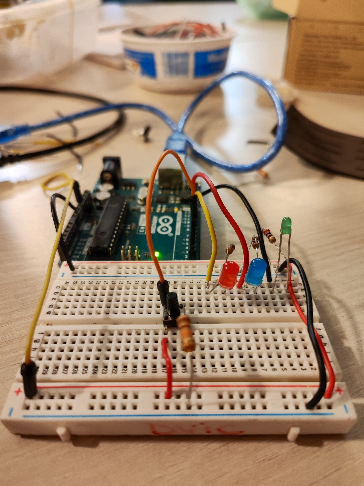

# 🎵 Jeu de Rythme avec Arduino & Pygame 🎮🎵

## Description
Ce projet est un **jeu de rythme** développé en Python avec la bibliothèque **Pygame**, en interaction avec un **microcontrôleur Arduino** pour gérer des boutons et des LED en série. Malheureusement le jeu ne fonctionne pas avec le microcontrôleur Arduino car il crash à son lancement lorsqu'il est connecté avec l'Arduino.  Le jeu permet aux joueurs de créer un personnage avec au choix un personnage masculin ou féminin et en entrant son nom. On peut ensuite sélectionner un des personnages qui a été crée dans la section joueur et appuyer sur start pour lanceer la partie. Au cours du jeu le programme permet d'enregistrer son score et sa précision dans un fichier **Excel**, à chaque fin de partie. Les statistiques du jeu sont dans des **graphiques** grâce à Jupyter Notebook et le joueur a aussi accès à un leaderboard dans le menu de séléction du personnage pour voir le classement courant (il se reset lorsqu'on ferme le programme mais est maintenu tant qu'il est ouvert même si plusieurs parties sont lancées). Afin de faciliter la prise en main, les miss ne sont pas contabilisé lorsque les cochons sortent de l'écran, ils sont comptabilisés uniquement quand le joueur appuie sur espace au mauvais timing lorsque le cochon approche la hitbox du personnage. Par aillerus l'intuition pour un perfect est la suivante : il faut appuyer sur espace lorsque le nez du cochon est au dessus de la boule jaune du personnage. Le menu pause s'affiche lorsque l'on appuie sur la touche "P" du clavier. Bon jeu ! 

## Fonctionnalités
- 🎮 **Jeu de rythme** avec des niveaux de précision (Perfect, Good, Miss).
- 📊 Sauvegarde des scores, des précisions, du sexe et noms des joueurs, et des dates dans un fichier Excel.
- 📈 Visualisation des données avec des graphiques grâce à **Jupyter Notebook**.
- 💡 **Intégration avec Arduino** : 
  - Détection de boutons pour démarrer le jeu ou déclencher des actions. (Crash lorsque le programme se lance mais les codes sont garder en commentaires à la ligne 11 à 13, 610 à 613, 1053 à 1063)
  - Activation de LED pour indiquer des niveaux de précision (`Perfect`, `Good`, `Miss`).
- Menu : principale, création de joueur, joueur, pause, gameover. 

## Photo du circuit Arduino 

## 🎬 Démonstration Vidéo

